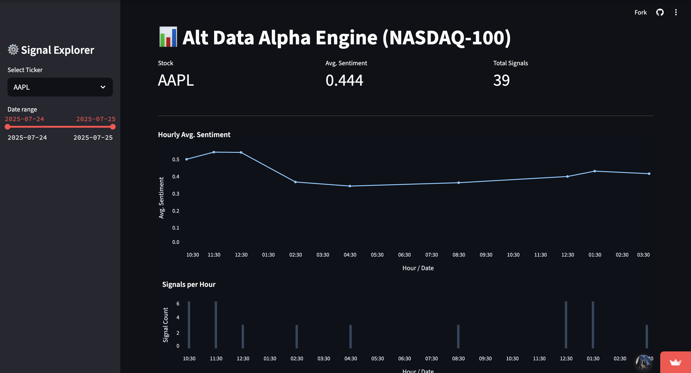

<table width="100%">
  <tr>
    <td valign="middle" width="30%">
      <a href="https://alt-data-alpha-engine.xyz">
        
      </a>
    </td>
    <td valign="middle" width="70%">
      <h1 style="margin: 0;">
        <a href="https://alt-data-alpha-engine.xyz">Alt Data Alpha Engine</a>
      </h1>
      <p style="margin: 0; font-style: italic;">
        <strong>AI-driven Alpha Generation with Alternative Data and Sentiment Analysis</strong>
      </p>
      <p style="margin-top: 8px;">
        
        
        <a href="LICENSE"></a>
        
      </p>
      <p style="margin-top: 16px; font-style: italic;">
        <strong>Built with the tools and technologies:</strong>
      </p>
      <p style="margin: 4px 0;">
        
        
        
        
        
        
        
      </p>
      <p style="margin: 4px 0;">
        
        
        
        
        
        
        
        
      </p>
    </td>
  </tr>
</table>

## 📈 Live Dashboard

👉 [**Launch the Dashboard ↗**](https://alt-data-alpha-engine.xyz)

*Updated twice weekly: Every Tuesday and Thursday at 07:00 UTC.*

---

## 🚀 Overview

The **Alt Data Alpha Engine** utilizes **alternative data sources** - including financial news, Reddit discussions, and SEC filings-combined with advanced **sentiment analysis** and rigorous quantitative backtesting to identify profitable trading signals.

**Key components**:

- **Alternative Data Collection**: Real-time data retrieval from Yahoo Finance, Reddit, and SEC Edgar.
- **Sentiment Scoring**: NLP-driven sentiment quantification using OpenAI models.
- **Signal Generation**: Quantile-based long/short signals with conviction scoring.
- **Backtesting**: Robust trading strategy validation with Backtrader.
- **Interactive Dashboard**: Streamlit-powered dashboard for detailed insights.
- **Automated Pipeline**: Regular automated data refresh and deployment to Hetzner VPS via GitHub Actions.

---

## 🎯 Features

- 🔍 **Real-time data pipeline** from Yahoo Finance, Reddit (`r/stocks`), and SEC Edgar (8-K filings).
- 📉 **Rolling sentiment analysis** across multiple horizons (1-day, 3-day, 5-day).
- 📊 **Conviction-based signal assignment** using adjustable quantile thresholds.
- ⚖️ **Comprehensive backtesting** evaluating Sharpe ratio, CAGR, maximum drawdown, and win rate.
- 📈 **Interactive visualization** with Streamlit dashboard and hourly sentiment aggregation.
- 🔄 **Fully automated weekly updates** using GitHub Actions.

---

## 🛠️ Tech Stack

| Component                | Technologies Used                                           |
|--------------------------|-------------------------------------------------------------|
| **Data Collection**      | Yahoo Finance (`yfinance`), Reddit (`PRAW`), SEC Edgar API  |
| **Sentiment Analysis**   | OpenAI, Python, Pandas, NumPy                               |
| **Signal Generation**    | Pandas, NumPy                                               |
| **Backtesting**          | Backtrader, Pandas, NumPy                                   |
| **Dashboard & Visualization** | Streamlit, Altair                                      |
| **Hosting & Infrastructure** | Hetzner Cloud VPS, Nginx, Systemd, Certbot (HTTPS)      |
| **Automation & CI/CD**   | GitHub Actions                                              |

---

## ⚡ Quickstart Guide

### 📌 Prerequisites

- Python 3.10 or newer
- Reddit API credentials ([Create here](https://www.reddit.com/prefs/apps))
- SEC Edgar API User Agent
- OpenAI API key
- NASDAQ API User Agent
- Hetzner Cloud VPS (optional for hosting)

### 💻 Installation

Clone this repository:

```bash
git clone https://github.com/Vansh-Coder/alt-data-alpha-engine.git
cd alt-data-alpha-engine
```

Install dependencies:

```bash
pip install -r requirements.txt
```

### 🔧 Configuration

Set up a `.env` file in the project root:

```env
REDDIT_CLIENT_ID=your_reddit_client_id
REDDIT_CLIENT_SECRET=your_reddit_client_secret
REDDIT_USER_AGENT=your_reddit_user_agent
SEC_USER_AGENT=your_sec_user_agent
OPENAI_API_KEY=your_openai_api_key
NASDAQ_USER_AGENT=your_nasdaq_user_agent
```

### 🚀 Running the Pipeline

Execute each script sequentially to build your dataset and signals:

```bash
python data_pipeline.py
python sentiment_analysis.py
python signals.py
```

For local backtesting (optional):

```bash
python grid_search.py
```

### 🖥️ Launch the Dashboard

Run Streamlit locally:

```bash
streamlit run dashboard.py
```

Then open: [`http://localhost:8501`](http://localhost:8501)

---

## 🔄 Automation with GitHub Actions

Automated data updates occur twice weekly (Tuesday & Thursday at 07:00 UTC).  
Configuration located in: `.github/workflows/update_pipeline.yml`

---

## 📂 Project Structure

```
alt-data-alpha-engine
├── data_pipeline.py           # Fetch latest alternative data
├── sentiment_analysis.py      # NLP-based sentiment analysis
├── signals.py                 # Generate signals
├── backtest.py                # Backtesting strategy implementation
├── grid_search.py             # Hyperparameter tuning
├── dashboard.py               # Streamlit dashboard interface
├── data/                      # Data directory
├── assets/                    # Assets directory
├── .github/workflows/         # Automation workflows
├── .env                       # Credentials and API configs
└── requirements.txt           # Dependencies
```

---

## 📸 Dashboard Preview



---

## 🌟 About the Author

- **Vansh Gupta** - Full-stack AI/ML engineer & software developer.  
  GitHub: [@Vansh-Coder](https://github.com/Vansh-Coder)  
  Email: vgupta95@asu.edu

---

## 🤝 Contributing

Contributions, suggestions, and improvements are welcome! Feel free to open issues or submit pull requests.

---

## 📜 License

This project is licensed under the **[MIT License](LICENSE)**.

---
